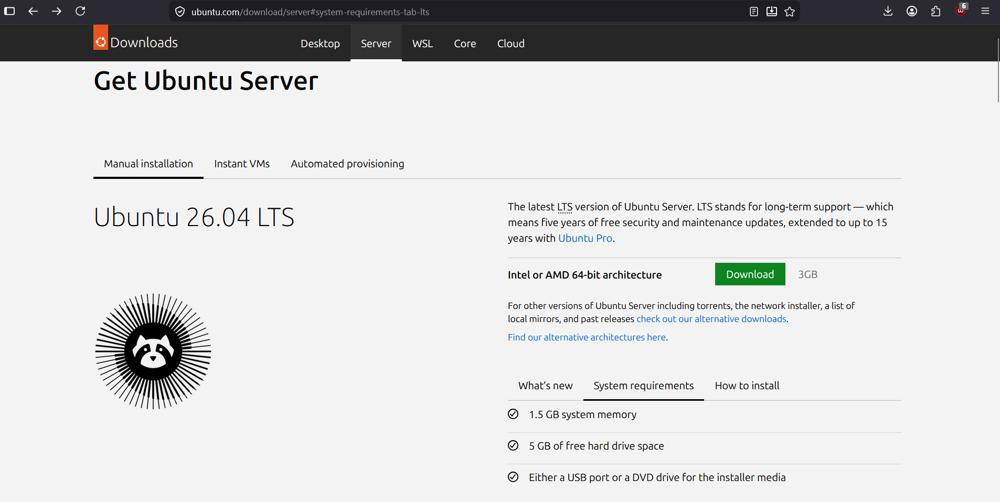
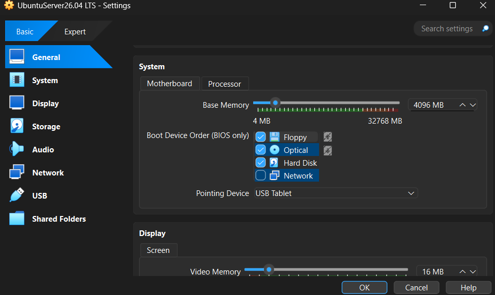
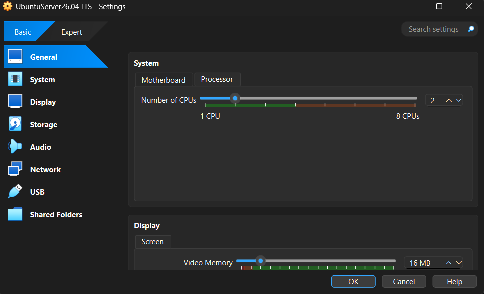
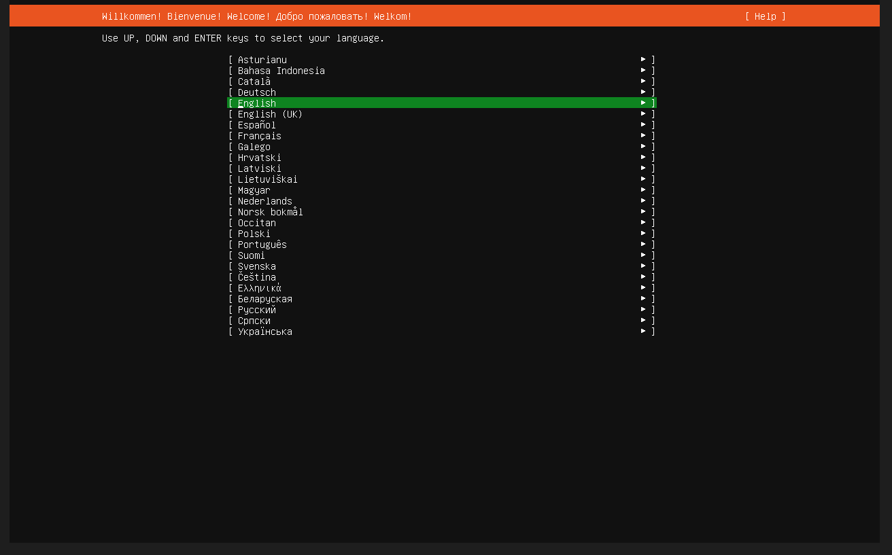
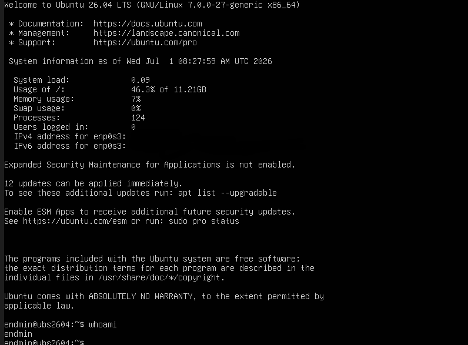

# Setting Up My Ubuntu Server Homelab

## Overview

The first step in my homelab project was installing **Ubuntu Server 26.04 LTS**. I downloaded the installation image from Ubuntu's official website and installed it on **Oracle VirtualBox**.

The purpose of this setup is to learn the fundamentals of Linux system administration, including installing and configuring a server, becoming comfortable with the Linux terminal, and building a foundation for more advanced homelab projects.

---

## Downloading Ubuntu Server

I downloaded the Ubuntu Server 26.04 LTS ISO from the official Ubuntu website.

**Official Download Page:**  
https://ubuntu.com/download/server

---

## Creating the Virtual Machine

After downloading the ISO file, I created a new virtual machine in Oracle VirtualBox and attached the Ubuntu Server ISO as the installation media.

 
## Installing the Server

And here's what it looked like once it is installed:

---

# Planned Configuration Tasks

After completing the Ubuntu Server installation, I will perform the following system administration tasks:

- [ ] Create multiple user accounts
- [ ] Create user groups
- [ ] Configure `sudo` permissions
- [ ] Configure SSH
- [ ] Disable SSH password authentication
- [ ] Update installed packages
- [ ] Install software using `apt`
- [ ] COnfigure unattended security updates
- [ ] Configure the system hostname
- [ ] Configure the firewall using UFW

---

## Learning Goals

By completing these tasks, I aim to:

- Understand Linux user and group management.
- Learn basic system administration.
- Practice securing a Linux server.
- Become more comfortable using the command line.
- Build a strong foundation for future homelab projects involving networking, virtualization, and server management.

---
## Setup of Home Lab:
                            Internet
                                │
                                │
                         VirtualBox NAT
                                │
                    Adapter 1 (enp0s3)
                                │
               ┌─────────────────────────┐
               │      Ubuntu Server      │
               │      myhomelab.local    │
               │                         │
               │  SSH Server             │
               │  UFW Firewall           │
               │  Avahi (mDNS)           │
               └─────────────────────────┘
                                │
                    Adapter 2 (enp0s8)
                     Internal Network
                     192.168.10.10/24
                                │
                                │
                    VirtualBox Internal Network
                                │
                     192.168.10.20/24
                    Adapter 1 (eth0)
                                │
               ┌─────────────────────────┐
               │        Kali Linux       │
               │                         │
               │ SSH Client              │
               │ ssh-agent               │
               │ Avahi Client            │
               └─────────────────────────┘
────────────────────────────────────────────────────────────────────────────────────────                
The Ubuntu uses two network adapters: one for NAT for internet access for package updates. The other is for internal network to make a private network to the client VM.
The Kali Linux vm is the client vm. It only uses one network adapter which is the internal network. This makes sure that it is connected only to the internet.

# Setup in live view:
Here is what it looks like in my perspective.                  

